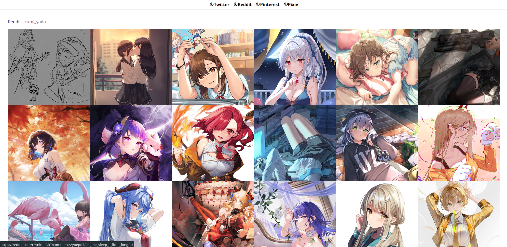

# Social Media Manager

**This website is not deployed anywhere anymore. Because Heroku is not free anymore :(**

You can run it locally if you set all the required environment variables in `.env`.

The backend can be run as docker container and the frontend on a local web server like apache. An example how to run it is in the script `run-steps.sh`.

## Features

### Post on multiple social medias

Currently only works via scripts in `./scripts`.
Log in through the REST API and save tokens in `.env` according to `.env.sample`

Post with python scripts or create a script like `main.sh`

Works for: Reddit, Twitter, Pixiv

### Reference Board

- Twitter: add users to show their posted images
- Reddit: shows all upvoted posts

## Endpoint Sources

- [x] **Reddit**: https://www.reddit.com/dev/api
- [x] **Twitter**: https://developer.twitter.com/en/docs/twitter-api
- [x] **Pixiv**: there is no official rest api documentation. But it's possible to find it using the pixiv mobile app
      and [mitmproxy](https://mitmproxy.org). The easiest way is using an [android emulator](https://genymotion.com/) (< Android 7.0)
- [ ] **Pinterest**: https://developers.pinterest.com/docs/api/v5/
- [ ] **Imgur**: should be possible, but no personal need right now.
- [ ] **Artstation**: they have an API but it seems to be more protected than pixiv. Finding the endpoints is not enough
- [ ] **Facebook**: Just no, they just want our data for everything
- [ ] **Instagram**: Need to go through facebook...

## Development

Backend

- Create `.env` file using `.env.sample` and set the values
- Install packages: `pip install -r requirements.txt`
- Start backend: `flask run`

Frontend: inside `./sns-manager`

- Install dependencies: `npm i`
- Start fronend: `npm run dev`
